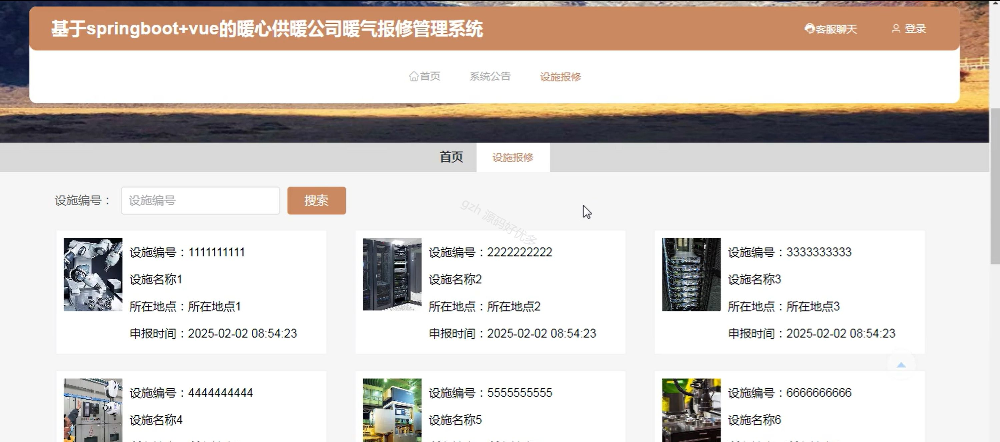
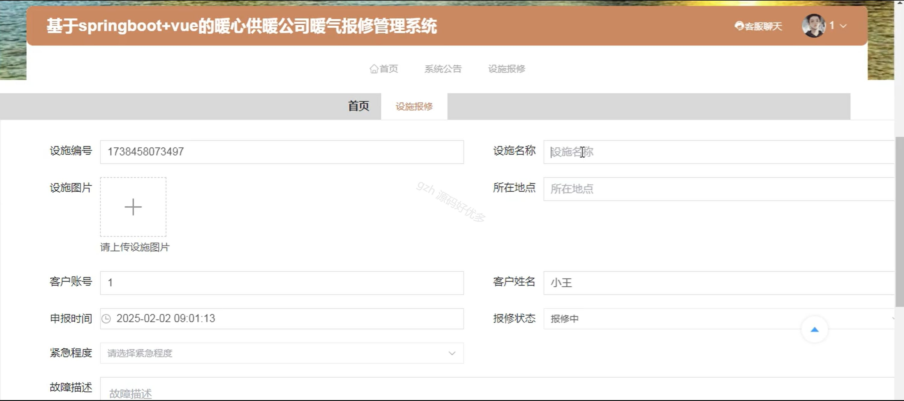
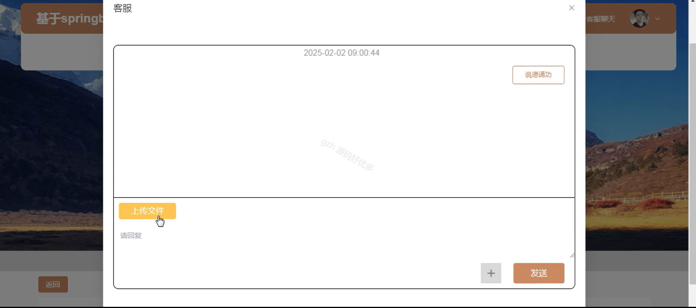
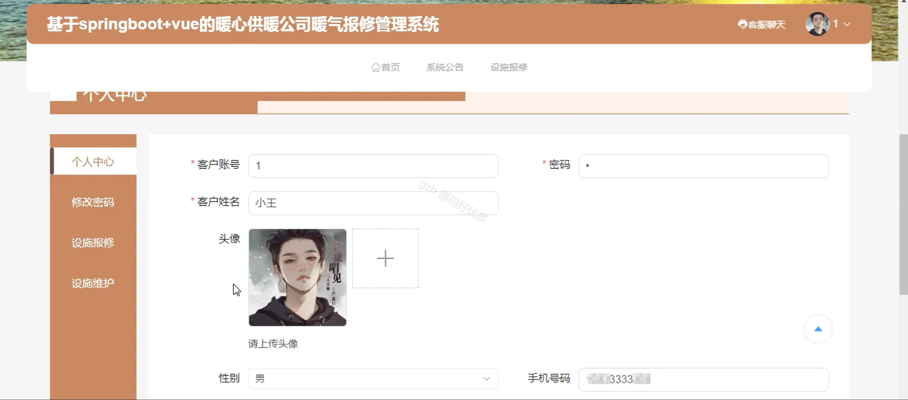
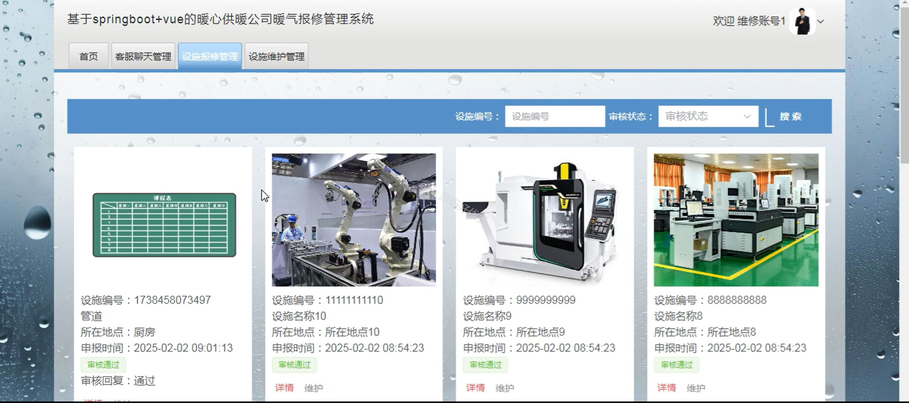
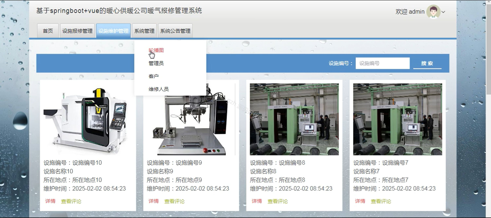
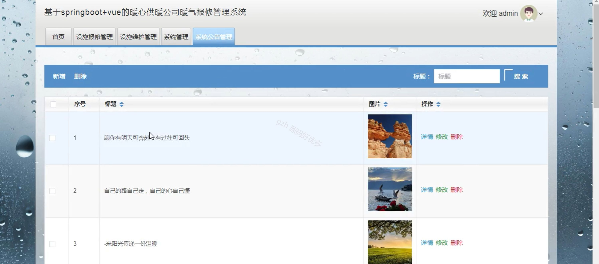
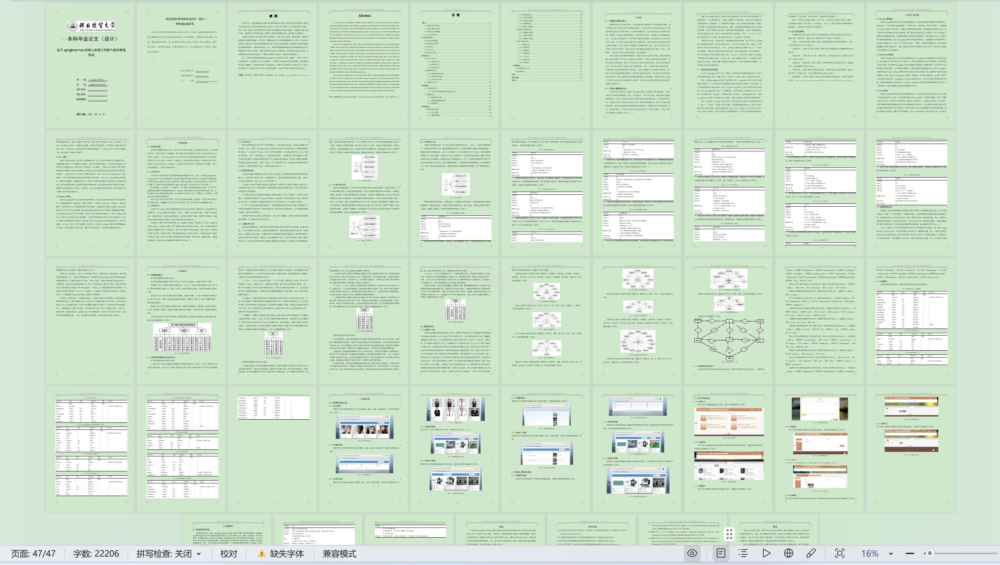

# springbootA186D
springbootA186D暖心供暖公司暖气报修管理系统+LW+PPT
 
## 查看主页获取源码

### 一、关键词
设施维护管理、设施报修管理、暖气报修

### 二、作品包含
源码+数据库+设计文档万字+ppt+全套环境和工具资源+本地部署教程

### 三、项目技术
前端技术：Html、Css、Js、Vue3.0、Element-ui 
后端技术：Java、SpringBoot3.0、MyBatis

### 四、运行环境（以下版本亲测，其他版本未知，请自测）
开发工具：IDEA/eclipse  + VSCODE

数据库：MySQL5.7（最低要5.7版本）

数据库管理工具：Navicat10以上版本

环境配置软件： JDK17 + Maven3.6.3

前端Nodejs：20

浏览器：谷歌浏览器

### 五、项目介绍
项目编号：springbootA186D

暖心供暖公司暖气报修管理系统可实现用户在线便捷报修、优化资源调配，从而高效解决用户暖气问题，提升供暖服务质量。

角色：管理员、用户、维修人员

管理员：首页、设施报修管理、设施维护管理、系统管理、系统公告管理。

用户：首页、系统公告、设施报修、个人中心、修改密码、设施维护。

维修人员：首页、客服聊天管理、设施报修管理、设施维护管理。

### 六、运行截图

